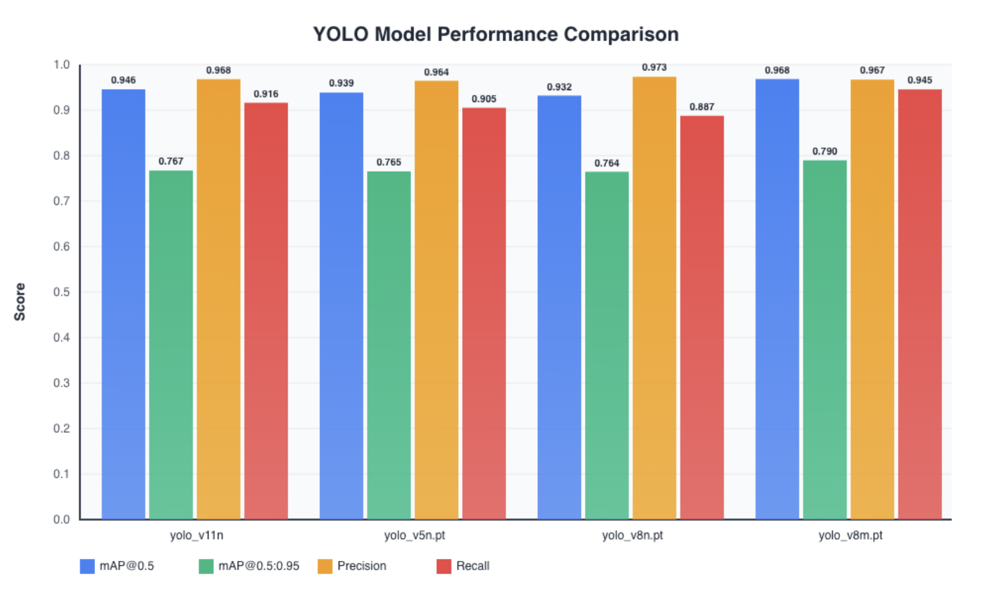

# GateDetection

## Overview

`GateDetection` is a collection of computer vision-based gate detection approaches implemented in Python and Jupyter Notebooks. This project includes multiple detection methods such as:

- **YOLO-based detection**
- **RCNN-based detection**
- **Color matching techniques**

* Dataset : https://www.kaggle.com/datasets/mobilal14/sauvc-dataset
* models : https://huggingface.co/Bilal1410/GateDetection-model
* Madras Dataset : https://app.roboflow.com/main-j13ii/gatedetection-ujxkq/3

## Results
| Model        | mAP@0.5 | mAP@0.5:0.95 | Precision | Recall |
| ------------ | ------- | ------------ | --------- | ------ |
| yolo_v11n    | 0.9456  | 0.7671       | 0.9679    | 0.9161 |
| yolo_v5n     | 0.9386  | 0.7652       | 0.9644    | 0.9051 |
| yolo_v8n     | 0.9319  | 0.7644       | 0.9732    | 0.8875 |
| yolo_v8m     | 0.9683  | 0.7897       | 0.9670    | 0.9454 |

## Results Visualization

* These results are obtained on the GateDetection Dataset (https://www.kaggle.com/datasets/mobilal14/sauvc-dataset) using Tesla P100-PCIE-16GB GPU.

* Model Comparison Notebook : [model-comparison.ipynb](model-comparison.ipynb)
